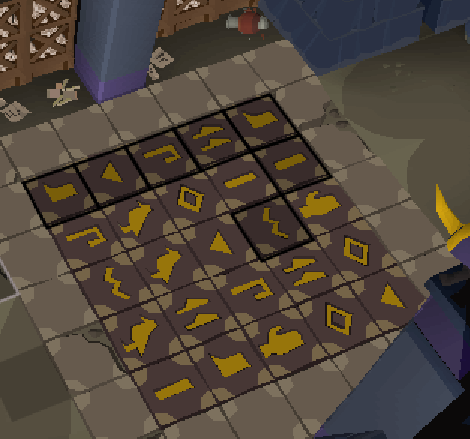

# Tombs of Amascut Puzzle Helper
This is a plugin that will make the Scarab Puzzle Room in Tombs of Amascut even more brain-dead than it already is.

Currently this plugin provides solutions to every puzzle except for the floor tile flip puzzle.

**Light Puzzle:**

- Marks the tiles in the sequence they lit up. If you mess up, it will reset the sequence labeled when you trigger the sequence again.

**Obelisk Puzzle:**

- Marks the obelisks in the sequence they lit up.

**Floor Tile:**

- Marks the correct tiles to walk on per the wiki.

**Matching:**

- When you flip a tile over, it labels that tile. It's fastest to flip all tiles on one side, then move to the other and do the same.

